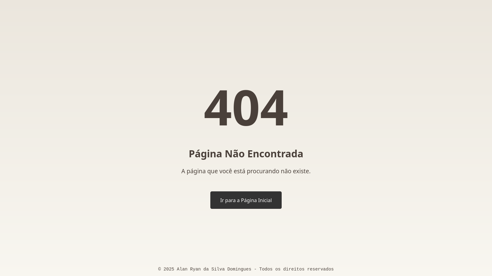
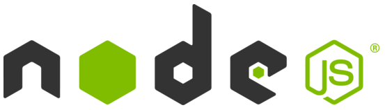
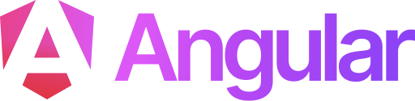

<h1 align="center">
  To Do List - Spring Boot SPA
</h1>

<div align="center">


<br />


</div>

## 🧭 Guia de Navegação (Índice)

- **[📖 Descrição](#descricao)**
- **[🎯 Objetivos](#objetivos)**
- **[📸 Ilustração](#ilustracao)**
- **[✨ Funcionalidades e Práticas Adotadas](#funcionalidades)**
- **[💻 Tecnologias Utilizadas](#tecnologias)**
- **[🔧 Pré-requisitos](#requisitos)**
- **[⚙️ Execução](#execucao)**
- **[🌐 Acesso](#acesso)**
- **[📁 Estrutura](#estrutura)**
- **[👤 Desenvolvedor](#desenvolvedor)**
- **[📫 Contribuir](#contribuicao)**
- **[📜 Licença](#licenca)**

## 📖 Descrição <a name="descricao"></a>

Este repositório contém a interface de usuário (UI) de uma **Lista de Tarefas (To Do List)**, desenvolvida como uma **Single Page Application (SPA)** utilizando **Angular**. A aplicação oferece uma experiência de usuário moderna e reativa, permitindo a criação, listagem, edição e remoção de tarefas de forma intuitiva e eficiente.

O frontend comunica-se com uma **API REST** (implementada com Java e Spring Boot) para manipulação e persistência dos dados em um banco de dados **MariaDB**. Esta SPA foi construída seguindo as melhores práticas do Angular, com foco em componentização, gerenciamento de estado e consumo de serviços HTTP.

A aplicação pode ser executada de forma independente em modo de desenvolvimento (**`ng s`**), ideal para evoluir e testar a interface de usuário. Além disso, ela também pode ser integrada a um ambiente completo e totalmente containerizado, que inclui backend e banco de dados, facilitando a configuração e execução do sistema como um todo.

Este projeto demonstra como criar uma experiência de usuário fluida com Angular, integrando-se de forma elegante a um backend RESTful.

## 🎯 Objetivos <a name="objetivos"></a>

- ✅ Fornecer um exemplo **prático, claro e bem-estruturado** de como construir uma **Single Page Application (SPA)** com **Angular 19+**, consumindo uma API RESTful.

- ✅ Demonstrar **boas práticas de desenvolvimento frontend**, como:

  - 📦 Componentização e arquitetura baseada em componentes.

  - 🔄 Gerenciamento de estado reativo.

  - 🧩 Injeção de dependências e serviços.

  - 🌐 Comunicação com APIs via HttpClient.

  - ✨ Criação de interfaces de usuário modernas, dinâmicas e reativas.

- ✅ Mostrar como o frontend pode ser integrado a um ecossistema completo e **containerizado com Docker**, incluindo backend (Spring Boot) e banco de dados (MariaDB), facilitando a configuração e execução do sistema como um todo.

- ✅ Servir como um **recurso de aprendizado acessível e progressivo**, ajudando iniciantes e desenvolvedores experientes a compreender conceitos essenciais do Angular e de desenvolvimento web moderno.

- ✅ Incentivar a **colaboração da comunidade open source**, estimulando a abertura de issues, pull requests e sugestões de melhorias.

## 📸 Ilustração <a name="ilustracao"></a>

- ### _Página inicial:_


- ### _Página não encontrada:_



## ✨ Funcionalidades e Práticas Adotadas <a name="funcionalidades"></a>

- **Interface Moderna e Reativa:** Desenvolvida como uma Single Page Application (SPA) com **Angular**, proporcionando uma experiência fluida e sem recarregamentos de página.

- **Operações CRUD completas:** Funcionalidades intuitivas para criar, listar, atualizar e excluir tarefas.

- **Arquitetura baseada em Componentes:** Estrutura modular e reutilizável, facilitando a manutenção e escalabilidade do código.

- **Comunicação com API RESTful:** Integração com um backend via `HttpClient` para consumir e manipular dados.

- **Componentes Visuais Consistentes:** Utilização do **Angular Material** para criar uma interface consistente, acessível e visualmente agradável.

- **Gerenciamento de Estado Reativo:** Uso de **RxJS** (`Observable` e `Subject`) para garantir que a interface sempre reflita os dados mais recentes.

- **Formulários Reativos:** Implementação com **Reactive Forms**, para validação e manipulação robusta dos dados de entrada.

- **Notificações de Feedback:** Sistema de mensagens para informar o usuário sobre o sucesso das operações realizadas.

- **Injeção de Dependências:** Código desacoplado e organizado com serviços como `TaskService` e `NotificationService`.

## 💻 Tecnologias Utilizadas <a name="tecnologias"></a>

| Tecnologia       | Descrição                                                                                               |
| ---------------- | ------------------------------------------------------------------------------------------------------- |
| Angular 19+      | _Framework para construção da Single Page Application (SPA)_                                            |
| TypeScript       | _Linguagem principal, adiciona tipagem estática ao JavaScript_                                          |
| HTML5            | _Linguagem de marcação para a estrutura da interface_                                                   |
| CSS & SCSS       | _Linguagens para estilização, com SCSS como pré-processador para estilos mais organizados e poderosos._ |
| Angular Material | _Biblioteca de componentes para interface moderna e consistente_                                        |
| RxJS             | _Biblioteca para programação reativa e gerenciamento de estado_                                         |
| Angular CLI      | _Ferramenta para scaffolding e manutenção de projetos Angular_                                          |
| Node.js & npm    | _Ambiente de execução e gerenciador de pacotes para frontend_                                           |

## 🚀 Começando

Para executar este projeto, você precisará ter as seguintes ferramentas instalados em sua máquina:

<div align="center">

## 🔧 Pré-requisitos <a name="requisitos"></a>

<a href="https://git-scm.com/" target="_blank">
  
</a>
<a href="https://nodejs.org/" target="_blank">
  
</a>
<a href="https://www.npmjs.com/" target="_blank">
  
</a>
<a href="https://angular.dev/" target="_blank">
  
</a>

</div>

<br />

- **Git -** Para controle de versão e clonar o repositório. [https://git-scm.com/](https://git-scm.com/)

- **Node.js e npm -** Ambiente de execução e gerenciador de pacotes para o frontend. É recomendado usar a versão LTS mais recente do Node.js. [https://nodejs.org/](https://nodejs.org/)

- **Angular CLI -** Ferramenta de linha de comando para gerenciar e executar a aplicação. [https://angular.dev/](https://angular.dev/)

Após instalar o Node.js, instale o Angular CLI +19 globalmente com o comando:

```bash
npm install -g @angular/cli@19
```

## ⚙️ Como Executar o Projeto <a name="execucao"></a>

Para rodar a aplicação localmente, siga os passos abaixo:

1.  **Clone o repositório:**

    ```bash
    git clone https://github.com/0nF1REy/to-do-list-springboot-spa
    cd to-do-list-springboot-spa
    ```

2.  **Iniciar um servidor de desenvolvimento local:**

    ```bash
    ng s
    ```

## 🌐 Acesso à Aplicação <a name="acesso"></a>

- Acesse em: **`http://localhost:4200`**

---

## 📁 Estrutura do Projeto <a name="estrutura"></a>

O projeto foi desenvolvido com base na estrutura padrão disponibilizada pelo **Angular CLI**, adotando uma **arquitetura** baseada em **componentes**, orientada por princípios de **modularidade** e **escalabilidade**. Essa abordagem resulta em um código limpo, bem organizado e flexível, facilitando sua evolução contínua e promovendo a colaboração eficiente entre os desenvolvedores.

```
to-do-list-springboot-spa/
├── angular.json                # Configuração do projeto Angular
├── package.json                # Dependências e scripts (npm)
├── README.md                   # Documentação
├── tsconfig.json               # Configuração do TypeScript
└── src/                        # Código-fonte da aplicação
    ├── app/                    # Lógica da aplicação
    │   ├── components/         # Componentes reutilizáveis (ex: rodapé)
    │   ├── models/             # Interfaces e modelos de dados (ex: Tarefa)
    │   ├── pages/              # Páginas completas (ex: Home, Not Found)
    │   ├── services/           # Lógica de negócios e comunicação com API
    │   ├── app.component.ts    # Componente principal
    │   └── app.routes.ts       # Rotas de navegação
    ├── styles/                 # Estilos globais (SCSS)
    ├── index.html              # Ponto de entrada HTML
    └── main.ts                 # Arquivo de inicialização da aplicação
```

---

## 👤 Sobre o Desenvolvedor <a name="desenvolvedor"></a>

<div align="center">

<table>
  <tr>
    <td align="center">
        <br>
        <a href="https://github.com/0nF1REy" target="_blank">
          
        </a>
        </p>
        <a href="https://github.com/0nF1REy" target="_blank">
          <strong>Alan Ryan</strong>
        </a>
        </p>
        ☕ Peopleware | Tech Enthusiast | Code Slinger ☕
        <br>
        Apaixonado por código limpo, arquitetura escalável e experiências digitais envolventes
        </p>
          Conecte-se comigo:
        </p>
        <a href="https://www.linkedin.com/in/alan-ryan-b115ba228" target="_blank">
          
        </a>
        <a href="https://gitlab.com/alanryan619" target="_blank">
          
        </a>
        <a href="mailto:alanryan619@gmail.com" target="_blank">
          
        </a>
        </p>
    </td>
  </tr>
</table>

</div>

---

## 📫 Contribuir <a name="contribuicao"></a>

Contribuições são muito bem-vindas! Se você deseja contribuir com o projeto, por favor, siga estes passos:

1.  **Faça um Fork** do repositório.

2.  **Crie uma nova Branch** para sua feature ou correção:

    ```bash
    git checkout -b feature/nome-da-feature
    ```

3.  **Faça suas alterações** e realize o commit:

    ```bash
    git commit -m "feat: Adiciona nova feature"
    ```

4.  **Envie suas alterações** para o seu fork:

    ```bash
    git push origin feature/nome-da-feature
    ```

5.  **Abra um pull request** para a branch `main` do repositório original.

### Recursos Úteis

- **<a href="https://www.atlassian.com/br/git/tutorials/making-a-pull-request" target="_blank">📝 Como criar um Pull Request</a>**

- **<a href="https://www.conventionalcommits.org/en/v1.0.0/" target="_blank">💾 Padrão de Commits Convencionais</a>**

## 📜 Licença <a name="licenca"></a>

Este projeto está sob a **licença MIT**. Consulte o arquivo **[LICENSE](LICENSE)** para obter mais detalhes.

> ℹ️ **Aviso de Licença:** © 2025 Alan Ryan da Silva Domingues. Este projeto está licenciado sob os termos da licença MIT. Isso significa que você pode usá-lo, copiá-lo, modificá-lo e distribuí-lo com liberdade, desde que mantenha os avisos de copyright.
