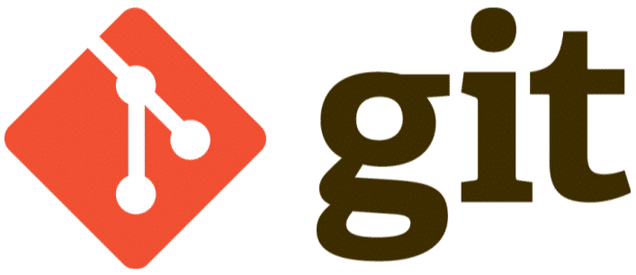

<h1 align="center">
  To Do List - Spring Boot SPA
</h1>

<div align="center">


<br />


</div>

## 🧭 Guia de Navegação (Índice)

## 📖 Descrição <a name="descricao"></a>

## 🎯 Objetivos <a name="objetivos"></a>

## ✨ Funcionalidades e Práticas Adotadas <a name="funcionalidades"></a>

## 💻 Tecnologias Utilizadas <a name="tecnologias"></a>

## 🚀 Começando

Para executar este projeto, você precisará ter as seguintes ferramentas instalados em sua máquina:

<div align="center">

## 🔧 Pré-requisitos <a name="requisitos"></a>

<a href="https://git-scm.com/" target="_blank">
  
</a>

</div>

<br />

- **Git:** Para controle de versão e clonar o repositório. [https://git-scm.com/](https://git-scm.com/)

---

## ⚙️ Como Executar o Projeto <a name="execucao"></a>

Para rodar a aplicação localmente, siga os passos abaixo:

1.  **Clone o repositório:**

    ```bash
    git clone https://github.com/0nF1REy/to-do-list-springboot-spa
    cd to-do-list-springboot-spa
    ```

2.  **Iniciar um servidor de desenvolvimento local:**

    ```bash
    ng serve
    ```

## ✅ Acesso à Aplicação <a name="acesso"></a>

-  Acesse em: **`http://localhost:4200`**

---

## 📁 Estrutura do Projeto <a name="estrutura"></a>

O projeto segue a estrutura xxx e adota uma xxx em xxx para ...

## 👤 Sobre o Desenvolvedor <a name="desenvolvedor"></a>

<table>
  <tr>
    <td align="center">
      <a href="https://github.com/0nF1REy" target="_blank">
        <br>
        <b>Alan Ryan</b>
      </a>
      <p>
        ☕ Peopleware | Tech Enthusiast | Code Slinger ☕<br>
        Apaixonado por código limpo, arquitetura escalável e experiências digitais envolventes.
      </p>
      <p style="font-weight: bold; color: #0077B5;">
        Conecte-se comigo:
      </p>
      <p>
        <a href="https://github.com/0nF1REy" target="_blank">
          
        </a>
        <a href="https://gitlab.com/alanryan619" target="_blank">
          
        </a>
        <a href="https://www.linkedin.com/in/alan-ryan-b115ba228" target="_blank">
          
        </a>
        <a href="mailto:alanryan619@gmail.com" target="_blank">
          
        </a>
      </p>
    </td>
  </tr>
</table>

</div>

---

## 📫 Contribuir <a name="contribuicao"></a>

Contribuições são muito bem-vindas! Se você deseja contribuir com o projeto, por favor, siga estes passos:

1.  **Faça um Fork** do repositório.

2.  **Crie uma nova Branch** para sua feature ou correção:

    ```bash
    git checkout -b feature/nome-da-feature
    ```

3.  **Faça suas alterações** e realize o commit:

    ```bash
    git commit -m "feat: Adiciona nova feature"
    ```

4.  **Envie suas alterações** para o seu fork:

    ```bash
    git push origin feature/nome-da-feature
    ```

5.  **Abra um pull request** para a branch `main` do repositório original.

### Recursos Úteis

- **<a href="https://www.atlassian.com/br/git/tutorials/making-a-pull-request" target="_blank">📝 Como criar um Pull Request</a>**

- **<a href="https://www.conventionalcommits.org/en/v1.0.0/" target="_blank">💾 Padrão de Commits Convencionais</a>**

## 📜 Licença <a name="licenca"></a>

Este projeto está sob a **licença MIT**. Consulte o arquivo **[LICENSE](LICENSE)** para obter mais detalhes.

> ℹ️ **Aviso de Licença:** © 2025 Alan Ryan da Silva Domingues. Este projeto está licenciado sob os termos da licença MIT. Isso significa que você pode usá-lo, copiá-lo, modificá-lo e distribuí-lo com liberdade, desde que mantenha os avisos de copyright.
